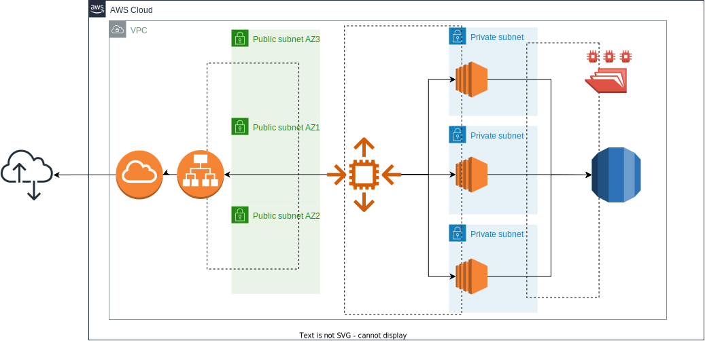

# ClaranetAutomation
Cloud architecture deploy automation of a web application that uses wordpress


The previous image describes the architecture that is created with the terraform template contained in this repository.
To run it please install the followings:
1. [Terraform](https://developer.hashicorp.com/terraform/tutorials/aws-get-started/install-cli)
2. [AWS CLI] (https://docs.aws.amazon.com/cli/latest/userguide/getting-started-install.html)
3. [Ensure that the AWS credentials are set](https://developer.hashicorp.com/terraform/tutorials/aws-get-started/aws-build#prerequisites)

Then, simply clone the repository: 
```
git clone https://github.com/PaoloPp/ClaranetAutomation.git
```

Move to the folder ClaranetAutomation/Terraform and run 
```
terraform init
terraform plan
terraform apply
```
With the last command you will be asked for the RDS DB password of your choice.
